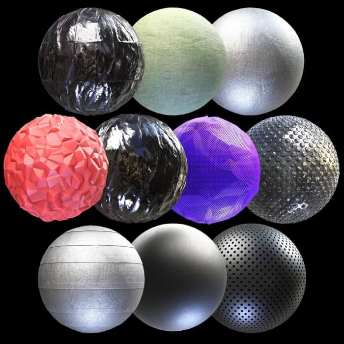
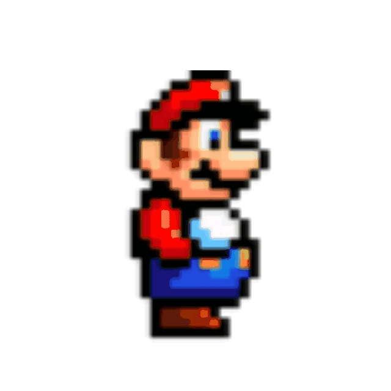
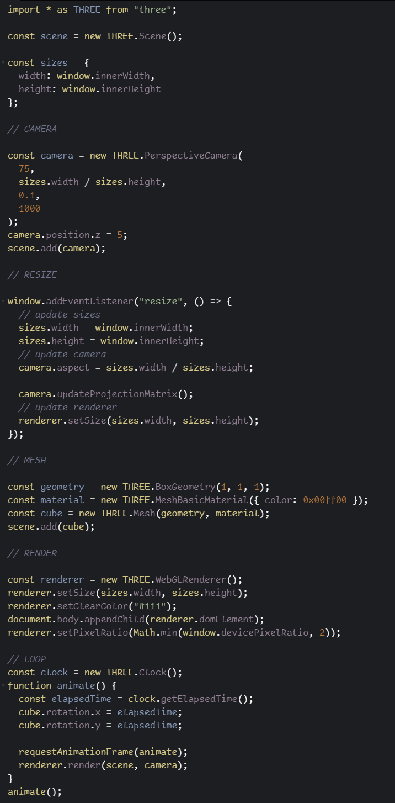
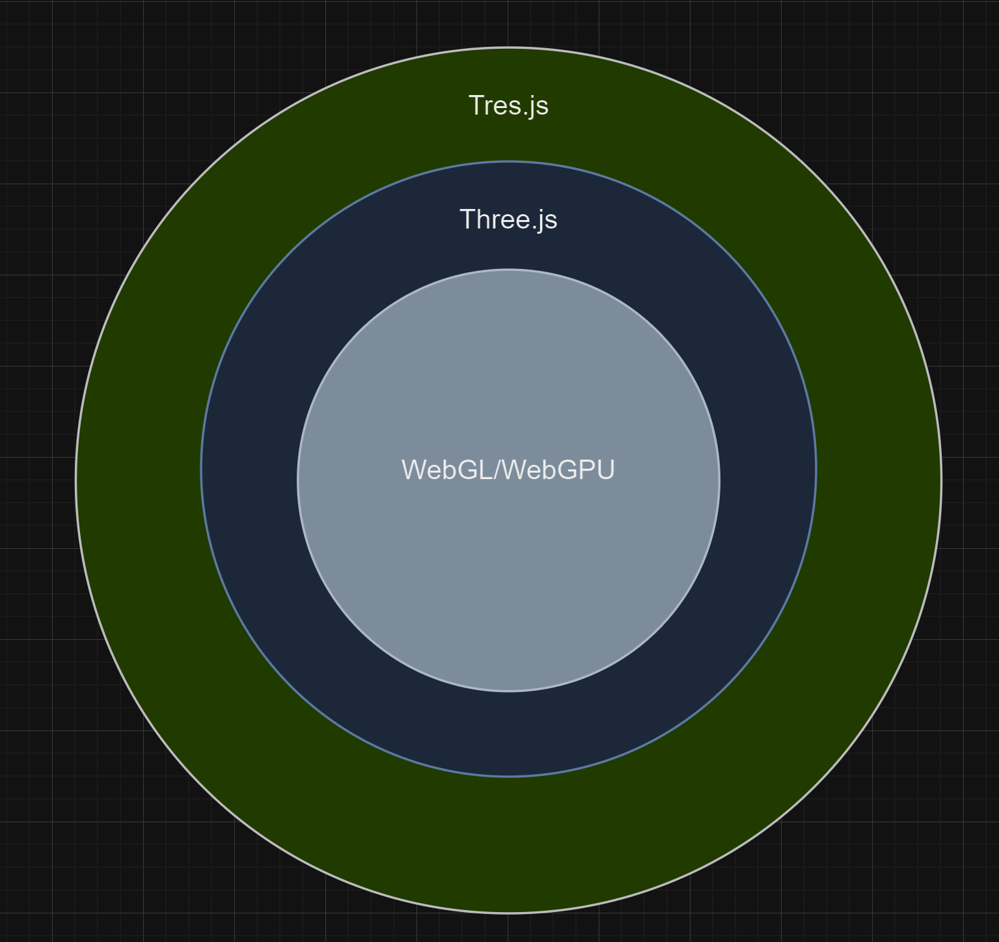

---
# You can also start simply with 'default'
theme: seriph
# random image from a curated Unsplash collection by Anthony
# like them? see https://unsplash.com/collections/94734566/slidev
background: './assets/tres-bg.png'
# some information about your slides (markdown enabled)
title: Tres.js
info: |
  ## Slidev Starter Template
  Presentation slides for developers.

  Learn more at [Sli.dev](https://sli.dev)
# apply unocss classes to the current slide
class: text-center
# https://sli.dev/features/drawing
drawings:
  persist: false
# slide transition: https://sli.dev/guide/animations.html#slide-transitions
transition: fade-out
# enable MDC Syntax: https://sli.dev/features/mdc
mdc: true
---

# Tres.js

Create awesome 3D experiences with Vue.js 💚

<div class="pt-12">
  <span @click="$slidev.nav.next" class="px-2 py-1 rounded cursor-pointer" hover="bg-white bg-opacity-10">
    Start <carbon:arrow-right class="inline"/>
  </span>
</div>

<!--
SLIDE 1
-->

---
transition: fade-out
---

# Hi, I'm Jaime

Feel free to ask me about... Vue.js, Three.js, Interactive graphic design 😊

- Born in Venezuela, moved to Italy, moved to Chile, moved to Yorkshire... Not long ago
- 👴🏽 32 years old
- 🍼 New dad
- 🤓 +7 years experiences in web development
- 💚 Vue and ThreeJs Lover

## Contact

- <carbon-logo-github /> https://github.com/JaimeTorrealba
- <carbon-logo-twitter /> https://twitter.com/jaimebboyjt
- <carbon-logo-linkedin /> https://www.linkedin.com/in/jaime-torrealba-cordova/

<style>
h1 {
  color: #f7f7f7
}
</style>

<!--
SLIDE 2
-->

---
transition: fade-out
---

# Why 3D on the web

Do we really need it?

<p v-click>But you might wanted </p>

<ul>
<li v-click>Almost all website are similar</li>
<li v-click>Unleash your creativity</li>
<li v-click>Effects impossible with simple JS or CSS</li>
<li v-click>Clients more engaged... More profit</li>
<li v-click>Real-time</li>
</ul>
<!--
SLIDE 3:
-->

---
transition: fade-out
level: 2
---

# I'm talking about this

https://enpowertrading.co.za/

https://www.igloo.inc/

https://lab.tresjs.org/

https://www.stefanobartoletti.it/

https://lab.jaimetorrealba.com/

<!--
SLIDE 4: }
- Everything you can do with Three.js you can do it with Tres.js
-->

---

# Fundamentals of 3D

Every 3D experience needs...

<ol>
<li v-click>🌐 Scene</li>
<li v-click>🎥 Camera</li>
<li v-click>🔩 Renderer</li>
<li v-click>🎳 An object</li>
<li v-click>🎬 RenderLoop (optional)</li>
</ol>
<br>
<div v-click>
<span><i>Let's ignore all the complicated math stuff</i></span>
</div>

<!--
- SCENE: Act as a container, allows us to do global operations like search, override, etc. You need at least one
- CAMERA: Allow us to see our 3D world (scene), `Perspective` `Orthographic` are the most used. Experience in photography helps
- RENDERER: Graphic engine, GPU bridge, draw our 3D world
-->

---
transition: fade-out
layout: two-cols
---
# Mesh

<div v-click class="px-2">
<h2>Geometry</h2>

</div>

::right::
<div class="mt-16 px-2" v-click>
<h2>Materials</h2>

</div>
<!--
- There are others way to create 3D object, but the triangular mesh is the most use.
- GPU are REALLY good handling triangles.
- MATERIALS: some react to the light
-->

---
transition: fade-out
layout: two-cols
---
# RenderLoop (optional)
Well... not quite
<p>Necessary for every real-time experience</p>
<p>Browsers have `RequestAnimationAPI`</p>
<p>FPS frame per second</p>

```js
function animate() {
  // Your animation goes here
  requestAnimationFrame(animate);
  renderer.render(scene, camera);
}
animate();
```

::right::



<!--
- What's the different between a film and a game?
- And what happen in reality?
-->

---
transition: fade-out
layout: two-cols
class: px-20
---

# It is a lot!


<p v-click="+3">
Boiler plate, complicated structure, way too many concepts, resize event, responsive...
</p>

::right::


<!--
With plane WebGL is worst, much more worst... Don't get me wrong is a good idea to understand this concepts. Imagine create a game, an implement everything from scratch.
-->

---
transition: fade-out
---

# Tres.js to the rescue

We abstract much of the logic, so you can focus in creating your 3D experience.

````md magic-move {lines: true}
```js {*|2|3|4|5|6}
//Three.js
const geometry = new THREE.BoxGeometry(1, 1, 1);
const material = new THREE.MeshBasicMaterial({ color: 0x00ff00 });
const cube = new THREE.Mesh(geometry, material);
cube.position.z = 5;
scene.add(cube);
```
```js {1|2|3|*}
<TresMesh :position-z="5" >
  <TresBoxGeometry :args="[1, 1,1]" />
  <TresMeshBasicMaterial color="0x00ff00" />
</TresMesh>
```
```js {*}
// logic into component
<BoxComponent />
```
```vue {*}
<script setup lang="ts">
import { TresCanvas } from '@tresjs/core'
</script>

<template>
  <TresCanvas
    clear-color="#82DBC5"
    window-size
  >
    <TresPerspectiveCamera
      :position="[3, 3, 3]"
      :look-at="[0, 0, 0]"
    />
    <BoxComponent />
  </TresCanvas>
</template>
```
````
<!--
Other libraries use similar approaches like r3f, threevelte, angular-three
-->
---
transition: fade-out
---
# Layers




<!--
I'll let all this sliders in my twitter
-->

<!--
SLIDE 9
-->
---
transition: fade-out
---
# Some data

- Created by Alvaro saburido https://x.com/alvarosabu
- VueJS + ThreeJS = TresJs 💚
- I'm accountable for Cientos, tres-path-tracing (beta) and tres-rapier (physics)
- More than 2.5K stars on GitHub (Ecosystem)
- Average npm download of 51K/month (just the core)
- Used by 600+ developers
- More than 590 users in Discord (https://discord.gg/MPdMCamK)

<!--
I'll let all this sliders in my twitter
-->
---
transition: fade-out
---
# Next steps

<ul v-click>
<li>Other libraries like R3f...</li>
<li>3D Models</li>
<li>Lights/Shadow</li>
<li>Physics</li>
<li>AR/VR (Vision pro)</li>
<li>photorealism (PBR, Ray-tracing)</li>
<li>CAD tools (like blender)</li>
</ul>

<!--
SLIDE 10
-->
---

# Thanks

Please ask if you have any questions.

Some important resources:

- https://tresjs.org
- https://egghead.io/courses/create-interactive-3d-experiences-with-tresjs-004057c2
- https://threejs-journey.com/
- https://www.youtube.com/@AlvaroDevLabs
- https://discord.gg/MPdMCamK

<!--
SLIDE 11
-->

---
